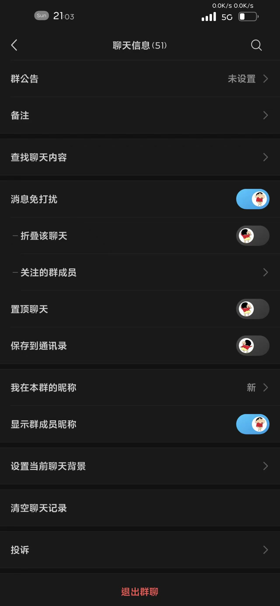

# SunMoon - 动态GIF开关效果

[English](#english) | [中文](#中文)

---

## 中文

### 📱 项目简介

SunMoon 是一个 iOS 越狱插件，将系统中所有的 UISwitch 开关替换为带有动态 GIF 动画效果的开关。开关在不同状态时显示不同的 GIF 动画。

### ✨ 主要特性

- 🎬 **动态GIF动画**：开关内部显示实时GIF动画
- 🔄 **状态切换**：开启/关闭状态显示不同的GIF效果
- 🎨 **渐变背景**：轨道背景支持动态颜色渐变
- 🔧 **无缝集成**：自动替换系统所有UISwitch，无需配置
- 💫 **流畅动画**：弹簧动画效果，切换自然

###  系统要求

- iOS 13.0 或更高版本
- 已越狱设备
- 支持架构：arm64, arm64e

### 🔧 安装方法

1. 下载 `.deb` 安装包
2. 使用 Cydia、Sileo 安装
3. 重启 SpringBoard
4. 插件自动生效

### 🔨 编译构建

```bash
git clone https://github.com/yourusername/SunMoon.git
cd SunMoon
xcodebuild -project SunMoon.xcodeproj -scheme SunMoon -configuration Debug build
```

### 🎨 自定义配置

修改 `SunMoon.xm` 文件中的 GIF URL：

```objc
// 开启状态GIF
NSURL *onGifURL = [NSURL URLWithString:@"YOUR_ON_GIF_URL"];
// 关闭状态GIF
NSURL *offGifURL = [NSURL URLWithString:@"YOUR_OFF_GIF_URL"];
```

---

## English

### 📱 Project Overview

SunMoon is an iOS jailbreak tweak that replaces all UISwitch controls with dynamic GIF-animated switches. Different GIF animations are displayed based on the switch state.

### ✨ Key Features

- 🎬 **Dynamic GIF Animation**: Real-time GIF animations inside switch thumbs
- 🔄 **State Switching**: Different GIF effects for ON/OFF states
- 🎨 **Gradient Background**: Dynamic color gradients for switch tracks
- 🔧 **Seamless Integration**: Automatically replaces all UISwitch controls
- 💫 **Smooth Animation**: Spring animation effects for natural transitions

###  System Requirements

- iOS 13.0 or higher
- Jailbroken device
- Supported architectures: arm64, arm64e

### 🔧 Installation

1. Download `.deb` package
2. Install using Cydia, Sileo
3. Restart SpringBoard
4. Tweak takes effect automatically

###  Building

```bash
git clone https://github.com/yourusername/SunMoon.git
cd SunMoon
xcodebuild -project SunMoon.xcodeproj -scheme SunMoon -configuration Debug build
```

### 🎨 Customization

Modify GIF URLs in `SunMoon.xm`:

```objc
// ON state GIF
NSURL *onGifURL = [NSURL URLWithString:@"YOUR_ON_GIF_URL"];
// OFF state GIF
NSURL *offGifURL = [NSURL URLWithString:@"YOUR_OFF_GIF_URL"];
```

## 📸 效果预览



## 👨‍💻 作者

**MacXK** - iOS越狱插件开发者
